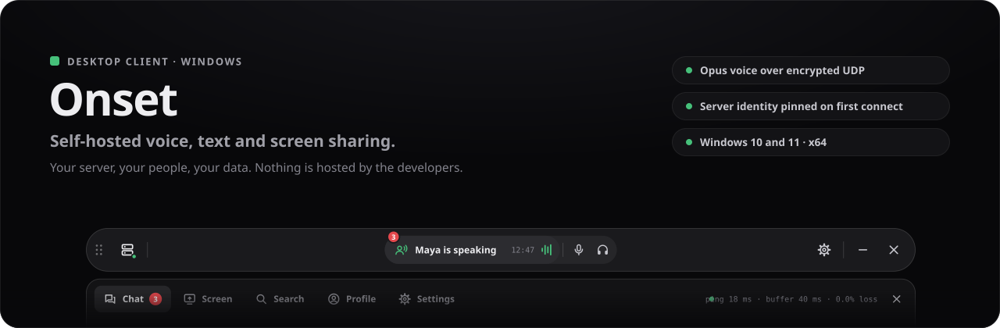
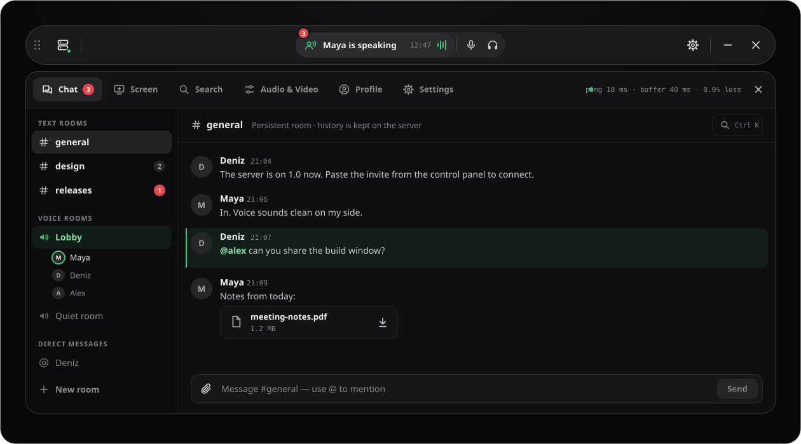
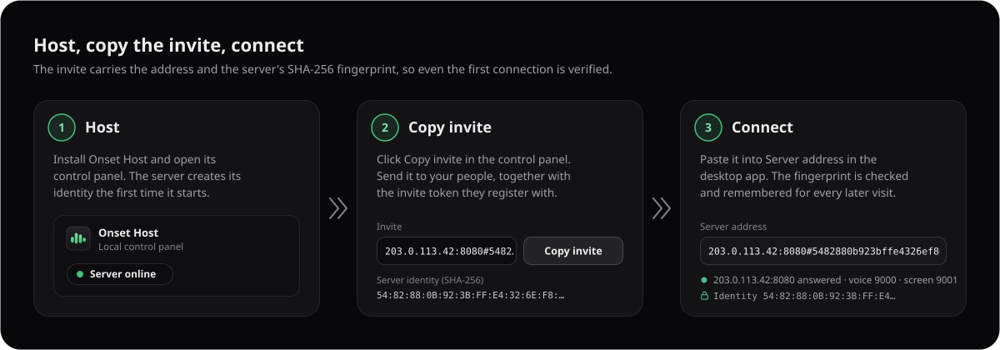

<p align="center">
  
</p>

<p align="center">
  <a href="https://github.com/firatkarakas/onset-client/releases/latest"><b>Download the latest release</b></a>
  &nbsp;·&nbsp;
  <a href="https://github.com/firatkarakas/onset-host">Host a server</a>
  &nbsp;·&nbsp;
  <a href="#verify-your-download">Verify your download</a>
  &nbsp;·&nbsp;
  <a href="#troubleshooting">Troubleshooting</a>
</p>

# Onset for Windows

Onset is a desktop app for group voice calls, text rooms and screen sharing on a server that you or a friend runs. There is no Onset account and no hosted service: the app connects straight to an [Onset Host](https://github.com/firatkarakas/onset-host) on someone's own Windows PC. It stays out of the way as a slim strip on the edge of your screen, and your call keeps running while you work in other windows.

This repository hosts the Windows installers, release notes and update feed. Downloads are on the [Releases page](https://github.com/firatkarakas/onset-client/releases/latest).


## Contents

- [Features](#features)
- [Install](#install)
- [Connect to a server](#connect-to-a-server)
- [Using the app](#using-the-app)
- [Verify your download](#verify-your-download)
- [Updates](#updates)
- [Security and privacy](#security-and-privacy)
- [Troubleshooting](#troubleshooting)
- [Uninstall](#uninstall)
- [License](#license)

## Features

**Voice**
- Opus voice at 48 kHz from a native audio engine, with echo cancellation, noise suppression, a microphone gate and packet-loss concealment.
- Voice travels over UDP with Onset's own encrypted protocol, GCA3 (ChaCha20-Poly1305, keys for each session, replay protection).
- Volume and "Mute for me only" for each person, set from that person's menu. It affects only what you hear.
- Voice activation or push-to-talk. Push-to-talk and the mute and deafen shortcuts are global, so they work while another app has focus.

**Text and files**
- Text rooms whose history is kept on the server, plus direct messages. Direct messages are text only; calls happen in voice rooms.
- Replies, edits, deletes, `@mentions`, unread counts and search across messages and files.
- File sharing with resumable uploads (up to 512 MiB per file by default; the server owner sets the limits) and inline image previews.
- A ping or nudge for someone who is online.

**Screen sharing**
- Share a window or a whole screen through the Windows picker. Choose 720p, 1080p or Source resolution at 15, 30 or 60 fps.
- Sound from the shared app is included. When you share a window, only that app's audio is captured; when you share a screen, Onset's own audio is left out so nobody hears themselves echoed back.
- Viewers can pop the stream out into a picture-in-picture window.

**Desktop**
- A docked strip that snaps to the top or bottom edge of the screen, or floats wherever you drop it.
- A ping readout on the strip, and ping, jitter-buffer depth and packet loss in the panel.
- System tray, start with Windows, desktop notifications and signed in-app updates.

<p align="center">
  
</p>

## Install

### Requirements

- Windows 10 or Windows 11, 64-bit (x64).
- Microsoft Edge WebView2 Runtime. Windows 11 already includes it. If it is missing, the installer downloads and installs it, which needs an internet connection.
- A microphone and speakers or headphones for calls.
- An Onset Host **1.0** to connect to, run by you or by someone you trust. See the [server repository](https://github.com/firatkarakas/onset-host).

### Steps

1. Open the [latest release](https://github.com/firatkarakas/onset-client/releases/latest) and download `Onset-<version>-x64.msi` and `SHA256SUMS`.
2. Optional, but a good idea: [check the file's hash](#verify-your-download).
3. Run the MSI. The installer is not signed with a paid code-signing certificate, so Windows SmartScreen may show **Windows protected your PC**. After you have checked the hash, choose **More info**, then **Run anyway**.
4. Start **Onset**. A small sign-in card appears in the middle of the screen.

## Connect to a server

<p align="center">
  
</p>

1. **Get an invite from the server owner.** It looks like `203.0.113.42:8080#` followed by 64 hexadecimal characters. That long part is the SHA-256 fingerprint of the server's certificate. If the server only allows invited people to register, also ask for the **invite token**.
2. **Paste the invite into Server address.** The card checks the server before you type a password. When it answers, you see a line such as `203.0.113.42:8080 answered · voice 9000 · screen 9001`.
3. **Create an account or sign in.** For a new account, choose **Register a new account**, pick a username (at least 2 characters) and a password (at least 8), and paste the invite token into the **Bootstrap token** field. Then choose **Create the account**. Accounts belong to one server, so you register separately on each server you join.
4. After you connect, the card turns into the strip. Your session is remembered, so you do not have to type your password again next time.

**Without an invite.** You can also type just `host:port`, for example `192.168.1.20:8080`. The app then trusts the certificate it sees when you first press **Connect** and pins it (trust on first use); merely typing an address never pins anything. To confirm you reached the right server, compare the **Identity** shown under the address with the fingerprint in the owner's control panel.

**Setting up your own server?** The first account on a new server becomes its **owner**. Register it with the **First owner setup token** from the control panel, entered in the **Bootstrap token** field. The [server README](https://github.com/firatkarakas/onset-host#first-start) walks through it.

## Using the app

**The strip.** From left to right: the grip (drag it to move the strip), the server button with a connection dot, the server address (click it to open the panel), the ping readout, the call pill, then microphone, headphones, screen share, notifications, **More** and **Settings**. The call pill shows, in this order of priority, *Deafened*, *Muted*, who is speaking, or the room name, along with the call time and a level meter. When you are not in a call, it becomes **Join voice**.

**The panel** has six tabs:

| Tab | What it is for |
| --- | --- |
| **Chat** | Rooms, direct messages, the conversation and the message box. In a voice room, the people in the call. |
| **Screen** | The shared screen, stream quality, picture-in-picture and full screen, and who is watching. |
| **Search** | Search messages and files. |
| **Audio & Video** | Microphone and speakers, levels, microphone test, push-to-talk key, screen-share quality and live reception counters. |
| **Profile** | Display name, avatar, password, theme and sign-out. |
| **Settings** | Window behaviour, notifications, global shortcuts, updates and log export. |

**More** has Minimise, Close to the tray, Disconnect, Sign out and Quit Onset. People with the right role also see New room and Administration there. Closing to the tray keeps your call running; click the tray icon to bring the window back.

**Keyboard.** These work while the app has focus and the cursor is not in a text field:

| Key | Action |
| --- | --- |
| `M` / `K` | Microphone on or off / headphones on or off |
| `E` | Start or stop sharing your screen |
| `Space` | Hold to talk, when the microphone mode is push-to-talk |
| `Ctrl` + `,` | Open settings |
| `Ctrl` + `K` | Find any room, person or action |
| `Ctrl` + `F` | Search the room you are reading |
| `Alt` + `↑` / `↓` | Move through the room list |
| `Esc` | Close the topmost layer |

The global shortcuts work even when another app has focus. They default to **Play/Pause** (mute) and **Stop** (deafen) on media keys, and **Ctrl+Shift+Space** for push-to-talk. Change them in **Settings** and **Audio & Video**.

## How it connects

<p align="center">
  
</p>

- **Control** (sign-in, chat, files) always uses HTTPS and secure WebSockets (WSS), and the certificate must match the pinned fingerprint.
- **Voice** uses UDP with the GCA3 protocol. The server relays each speaker separately, which is how you can set each person's volume on your side.
- **Screen sharing** uses WebRTC through the server's forwarding unit (SFU), encrypted with DTLS-SRTP.

The ports are chosen by the server owner. The defaults are TCP 8080, UDP 9000 and UDP 9001.

## Verify your download

Each release includes a `SHA256SUMS` file. In PowerShell, from the folder you downloaded to:

```powershell
$file = 'Onset-1.0.0-x64.msi'   # the file you downloaded
$expected = (Select-String -Path .\SHA256SUMS -Pattern ([regex]::Escape($file) + '$')).Line.Split(' ')[0]
$actual = (Get-FileHash ".\$file" -Algorithm SHA256).Hash
if ($actual -eq $expected) { 'OK: the hash matches' } else { 'MISMATCH: do not install this file' }
```

Or run `Get-FileHash .\Onset-1.0.0-x64.msi -Algorithm SHA256` and compare the result with the matching line in `SHA256SUMS` yourself (upper and lower case do not matter).

The hash confirms that your download matches the published file. It does not replace a code-signing certificate, which this project does not have. In-app updates are checked separately against the update signing key built into the app (see below).

## Updates

- The app checks for a new version shortly after it starts, using this repository's `latest.json`. When one is available, a banner shows the version and a **Restart** button. You can also check from **Settings → Updates → Check now**. Each package is verified against the updater signature built into the app before it is installed. Packages that fail the check are not installed.

## Security and privacy

- **Nothing is hosted by the developers.** There are no Onset accounts, relays, analytics or crash reports sent to the project. The app talks only to the servers you add, and to GitHub when it checks for updates.
- **Server identity.** Every server has its own long-lived certificate. The app pins its fingerprint from the invite, or on first contact. If a server ever presents a different identity, the app refuses to connect and shows both the remembered and the presented fingerprints. It connects only if you explicitly choose **Trust the new identity**, which you should do only after confirming the new fingerprint with the server owner.
- **Encryption in transit.** Control traffic uses TLS (HTTPS/WSS), voice uses GCA3 (ChaCha20-Poly1305), and screen sharing uses DTLS-SRTP. This protects traffic between you and the server. The server decrypts and re-encrypts voice for each listener and stores messages and files, so whoever runs the server can technically access them. This is not end-to-end encryption. Only join servers run by people you trust.
- **Your sign-in** is stored on your PC, protected with Windows DPAPI for your Windows user account. Passwords are stored on the server only as bcrypt hashes.
- **Call diagnostics.** While you are in a call, the app sends audio and screen-share statistics (packet counts, buffer depth, loss, device names, app version) to *the server you are connected to*, not to the developers. Audio, video, message text and file names are never included. The server owner can turn this off.

## Troubleshooting

<details>
<summary><b>Windows SmartScreen says "Windows protected your PC"</b></summary>

The installer is not Authenticode-signed, because the project does not buy a code-signing certificate, and new releases have no SmartScreen reputation yet. [Verify the hash](#verify-your-download), then choose **More info → Run anyway**. Your browser may also warn that the file is not commonly downloaded. Choose **Keep**.
</details>

<details>
<summary><b>"This server's identity changed"</b></summary>

The server presented a different certificate from the one the app remembered. Either the owner reinstalled or reset the server without restoring its identity, or something between you and the server is impersonating it. Ask the owner to read out the **Server identity (SHA-256)** from their control panel. Choose **Trust the new identity** only if it matches the **Presented** fingerprint. If you used an invite and see *"This server's identity does not match the invite"*, ask the owner for a fresh invite.
</details>

<details>
<summary><b>"No answer from …"</b></summary>

- Check the address and port. The owner's control panel shows the exact **Client address** and **Invite**.
- Make sure the server is running (its panel shows **Server online**).
- On a local network, the server PC's Windows network profile must be **Private** for its firewall rule to allow you in.
- Over the internet, the owner's router must forward the control TCP port and both UDP ports (see the [server README](https://github.com/firatkarakas/onset-host#ports-and-firewall)).
</details>

<details>
<summary><b>Chat works but there is no voice, or screen shares do not load</b></summary>

Chat uses TCP, but voice and screen sharing use UDP. If chat works and calls are silent, the server's voice UDP port (default 9000) is blocked or not forwarded. If screen shares do not start, check the screen UDP port (default 9001). Check that you and the server are both on version 1.0.
</details>

<details>
<summary><b>Registration is refused</b></summary>

*"Registration is closed; ask the server owner for an invite token"* means the server needs an invite token, or does not accept new accounts at all. Paste the token from the owner into **Bootstrap token**. For the very first account on a new server, use the **First owner setup token** from the control panel.
</details>

<details>
<summary><b>Global shortcuts do not work</b></summary>

Another app may already use the same key. Rebind the shortcut in **Settings → Global shortcuts**, or the push-to-talk key in **Audio & Video**.
</details>

## Uninstall

Open **Settings → Apps → Installed apps**, find **Onset** and choose **Uninstall**. Settings, your remembered servers and your saved sign-in live in your Windows profile under `%APPDATA%\com.onset.desktop` and `%LOCALAPPDATA%\com.onset.desktop`. Delete those folders if you want to remove them as well. Messages and files are stored on the servers, not on your PC.

## Related

- **[Onset Host](https://github.com/firatkarakas/onset-host)**: the Windows installer for hosting your own server, with its local control panel.
- **[Releases](https://github.com/firatkarakas/onset-client/releases)**: every version, with release notes and checksums.

## License

Onset is freeware: free to use and not offered for profit. © Fırat Karakaş. All rights reserved. You may share unmodified copies of the official installer as long as you charge nothing for them. The full terms, including the warranty disclaimer, are in [LICENSE.txt](LICENSE.txt).

Onset is built on open-source components. Their licenses and full license texts are in `THIRD-PARTY-NOTICES.md`, which is installed next to the program and attached to every release.

This repository contains release files only. The source code is not published here.
